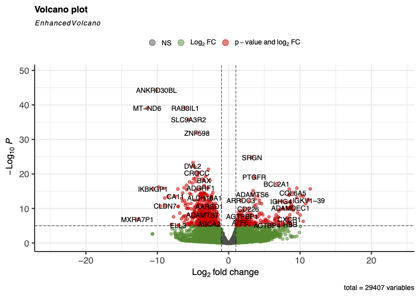
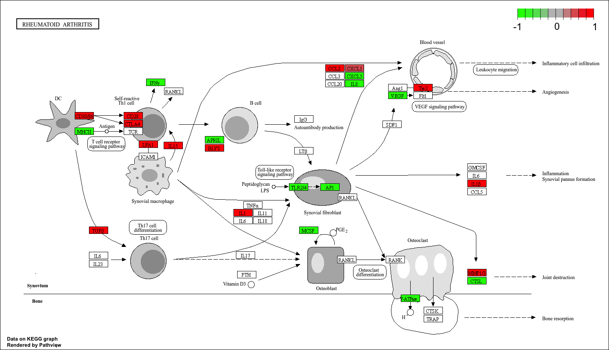

## Rheuma artritis - Transcriptomics - J2P4 Project 

## Inleiding

Reumatoïde artritis (RA) is een chronische systemische auto-immuunziekte die wordt gekenmerkt door persisterende synovitis, een ontsteking van het gewrichtsslijmvlies. Deze ontsteking leidt tot progressieve gewrichtsschade, waaronder erosie van kraakbeen en bot, wat uiteindelijk kan resulteren in functieverlies en invaliditeit. De pathogenese van RA is complex en ontstaat door een samenspel van genetische aanleg, omgevingsfactoren en een ontregeld immuunsysteem. Hierbij spelen immuuncellen zoals T-cellen en B-cellen een centrale rol in het ontstekingsproces en de productie van autoantistoffen [Firestein et al., 2017](https://github.com/J4nBoersma/Jan-Boersma/blob/main/Bronnen/Firestein%20et%20al.%2C%202017.pdf).
Een belangrijk kenmerk van RA is de aanwezigheid van autoantistoffen zoals ACPA (anti-citrullinated protein antibodies), die vaak al jaren vóór het ontstaan van klinische symptomen aanwezig kunnen zijn. Vroege diagnose en behandeling zijn essentieel om blijvende gewrichtsschade te beperken. Hoewel therapieën zoals DMARD’s de ziekteactiviteit kunnen remmen, blijft RA ongeneeslijk en is er behoefte aan beter inzicht in de moleculaire mechanismen achter de ziekte [Smolen et al., 2016](https://github.com/J4nBoersma/Jan-Boersma/blob/main/Bronnen/Smolen%20et%20al.%2C%202016.pdf).
Transcriptomics biedt hiervoor een krachtige methode om verschillen in genexpressie in ontstoken synovium te analyseren. Door middel van RNA-sequencing kunnen genen worden geïdentificeerd die differentieel tot expressie komen tussen RA-patiënten en controles. Vervolgens kan met Gene Ontology-analyse worden bepaald welke biologische processen en pathways betrokken zijn bij de ziekteontwikkeling.

---
## Methode

<small><small>
**Figuur 1.** *Workflow voor de Transcriptomics analyse van de genen en pathways bij RA patiënten en controle groep.*</small></small>

Voor dit onderzoek is gebruikgemaakt van RNA-sequencing (RNA-seq) data afkomstig van synoviumbiopten. De dataset bestaat uit acht samples: vier van controles zonder reumatoïde artritis (RA) en vier van RA-patiënten met een ziekteduur van >12 maanden. Alle patiënten waren ACPA-positief, terwijl controles ACPA-negatief waren. De data zijn afkomstig uit Platzer et al. (2019).
De analyse is uitgevoerd in R. Eerst is het humane referentiegenoom GRCh38.p14 (GCF_000001405.40) geïndexeerd met behulp van het R-package Rsubread (v2.24.0). Vervolgens zijn paired-end reads uitgelijnd tegen dit referentiegenoom, waarna BAM-bestanden zijn gegenereerd voor alle samples.
Op basis van de alignments is met featureCounts een gen-level countmatrix opgesteld met behulp van een GTF-annotatiebestand. Deze matrix vormde de input voor downstream analyse in DESeq2 (v1.50.2). Na normalisatie is een differentiële expressieanalyse uitgevoerd om genen te identificeren met significante expressieveranderingen tussen RA- en controlegroepen (padj < 0.05, |log2FC| > 1).
Voor visualisatie is een volcano plot gegenereerd met EnhancedVolcano. Daarnaast zijn significant differentieel tot expressie komende genen geselecteerd voor functionele verrijkingsanalyses. Gene Ontology (GO)-analyse is uitgevoerd met clusterProfiler, waarbij biologische processen, cellulaire componenten en moleculaire functies zijn onderzocht. KEGG pathway-analyse is gebruikt om verrijkte signaalroutes te identificeren. Visualisatie van pathways is uitgevoerd met pathview

## Resultaten

### Volcano plot
Na het uitvoeren van de differentiële expressie-analyse tussen de RA en controlesamples op basis van de count matrix, zijn de resultaten uitgezet in een volcano plot. De volcano plot [Figuur 2.](https://github.com/J4nBoersma/Jan-Boersma/blob/main/Resultaten/Vulcanoplot-WC3.png#:~:text=Vulcanoplot,-%2DWC3.png) toont meerdere significant differentieel geëxpresseerde genen tussen RA-patiënten en gezonde controles. Genen zoals *SRGN*, *BCL2A1* en *CXCR1* vertonen een verhoogde expressie in RA, terwijl *ANKRD30BL*, *MT-ND6* en *SLC9A3R2* juist een verlaagde expressie laten zien. Daarnaast lijkt het aantal significant neer-gereguleerde genen groter dan het aantal sterk op-gereguleerde genen. Deze resultaten wijzen op duidelijke veranderingen in genexpressie binnen het synoviale weefsel van RA-patiënten.

<small><small>
**Figuur 2.** *Volcano plot van de differentiële genexpressieanalyse tussen synoviumbiopten van RA-patiënten (n = 4) en gezonde controles (n = 4), uitgevoerd met DESeq2. De x-as geeft de log₂ fold change weer en de y-as de −log₁₀ p-waarde. Rode punten vertegenwoordigen genen met een significante verandering in expressie.*
</small></small>

---
### Kegg-Analyse
De KEGG pathway-analyse identificeerde verschillende significant verrijkte signaalroutes onder de differentieel geëxpresseerde genen [Figuur 3.]( De sterkst verrijkte pathway was de MAPK-signaling pathway, gevolgd door onder andere de Epstein–Barr virus infection-, NOD-like receptor signaling- en TNF signaling pathways. Daarnaast werden immuungerelateerde pathways zoals de NF-κB-, IL-17- en Th17 cell differentiation pathways significant verrijkt gevonden. Deze resultaten wijzen op een belangrijke betrokkenheid van ontstekings- en immuunresponsprocessen bij de pathogenese van reumatoïde artritis.

  
  

 

<small><small>
**Figuur 3.** *KEGG-analyse van differentieel tot expressie gebrachte genen tussen RA-patiënten en een gezonde controle. Dotplot van de verrijkte KEGG-pathways, waarbij de grootte van de punten het aantal genen per pathway weergeeft en de kleur de gecorrigeerde p-waarde representeert (Links). Barplot van de meest verrijkte KEGG-pathways, weergegeven op basis van het aantal tot expressie gebrachte genen (Rechts).*
</small></small>

---
### Go-Analyse
De GO-verrijkingsanalyse liet zien dat de significant differentieel geëxprimeerde genen voornamelijk betrokken zijn bij immuungerelateerde processen [Figuur 4](. De sterkst verrijkte GO-termen waren onder andere lymphocyte differentiation, adaptive immune response en leukocyte mediated immunity. Daarnaast werden processen gerelateerd aan T-cel- en B-celactivatie significant verrijkt gevonden. Deze resultaten wijzen op een verhoogde activiteit van de adaptieve immuunrespons in het synovium van RA-patiënten ten opzichte van controles.

**Figuur 4.** *GO-enrichmentanalyse van differentieel tot expressie komende genen in synovium (RA vs. controle). De dotplot toont significante verrijkte biologische processen (padj < 0,05). De x-as geeft de GeneRatio weer, de grootte van de punten het aantal genen per term en de kleur de significantie.*

---
### Pathwayview-Visualisatie Analyse
Om de differentiële genexpressie binnen de context van een bekende ziekteroute te visualiseren, werden de expressiewaarden geprojecteerd op de KEGG Rheumatoid Arthritis pathway (hsa05323). De pathway-analyse liet zien dat meerdere genen betrokken bij ontstekings- en immuunprocessen differentieel tot expressie kwamen tussen RA-patiënten en controles. Met name componenten van cytokine-gemedieerde signaaltransductie, lymfocytactivatie en ontstekingsroutes vertoonden veranderingen in expressie. Zo werden onder andere CD28, CTLA4, IL1A, IL15, CCL2, CXCL1, IL1B en MMP13 verhoogd tot expressie gebracht. Deze genen spelen een belangrijke rol bij T-celactivatie, cytokinesignalering, recrutering van immuuncellen en gewrichtsdestructie. Daarentegen vertoonden genen zoals IFNG, VEGF, IL8, TLR2/4, AP1 en CTSL een lagere expressie. Deze bevindingen ondersteunen de resultaten van de GO- en KEGG-verrijkingsanalyses, waar eveneens een sterke betrokkenheid van immuun- en ontstekingsgerelateerde processen werd gevonden. De geobserveerde expressieveranderingen binnen de RA-pathway zijn consistent met de bekende pathogenese van reumatoïde artritis.

  
  

<small><small>
**Figuur 5.** *Visualisatie van differentieel geëxpresseerde genen binnen de KEGG Rheumatoid Arthritis-pathway (hsa05323) met behulp van Pathview. Rood gekleurde genen zijn opgereguleerd, terwijl groen gekleurde genen zijn neergereguleerd. Niet-ingekleurde genen waren niet differentieel geëxpresseerd of konden niet worden gemapt op de pathway.*</small></small>

---
## Conclusie
